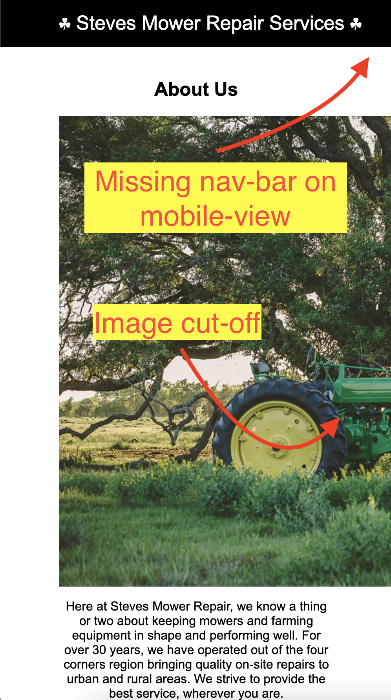
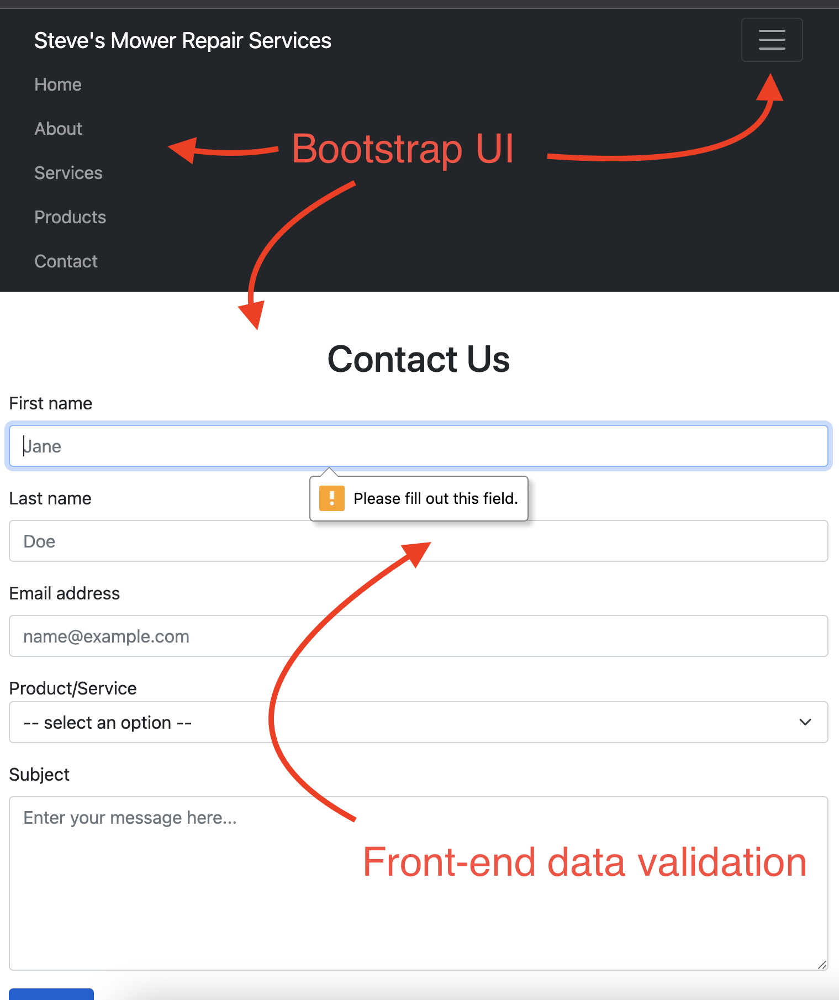

## Professional Self-Assessment

Throughout my time in the Computer Science program at SNHU, I have learned quite a bit about about all things computer-related. I have learned the software development process, how operating systems work, UML diagramming, and much more. Developing an ePortfolio has given me a way to reflect on how far I have come since starting this program and how all the fundamentals come together. I can now take designing, testing, and other SDLC facets and apply them to my software development process. 

In my program, I worked with others, using Git and BitBucket to collaborate on projects. Working on teams and using these programs, I learned how to create solutions with others in an effective and efficient manner so deliverables can be submitted on-time and communication to stakeholders can be addressed promptly. In my team development class, we collaborated to create a single Java application and had around 20 people entirely on the “same page” even though we spanned multiple timezones. 

Early in my program all the way up to now, we used various data structures to create solutions that were flexible and appropriate. One particular class heavily involved algorithms in C++ to teach various searching methods and how to create different data structures (queues, stacks, lists, etc.). I learned how to write classes to build objects and how to use UML diagrams for blueprinting those classes so the same UML diagram can be used as a blueprint for multiple (coding) languages.

In various courses, I used software to design solutions to various problems, including full-stack solutions and locally run applications. I learned how to read data into programs via .csv files, process it, and render it to an appropriate part of the program. Using Python, we created a program that sorted data queried from a database and rendered it to a graphical user interface that was stylish and provided a good user experience. We also learned how to test programs using unit testing, so our code can be more robust and well-understood.

In my program, I learned how to use SQL to query databases - this provided a strong base for persistent data-storage and allowed me to tie together all the main aspects of full-stack development: the front-end, back-end, and database. I also learned how to use NoSQL (specifically, MongoDB) as an alternative to traditional SQL - this allowed me to see databases as more than one unified technology.

Creating secure software is paramount to a successful application. Over the past few years I have learned how to code in a manner that is more secure and less prone to attack or accident. Sometimes adding security can be as simple as setting a method or variable to private and at other times can be as complicated as adding profiles and authentication/authorization to each resource in your application. I learned how to add these security features and much more.

My program had a focus in software engineering and instructed me to see software as much more than just code on a page. Compiling, testing, UML designs, and collaborative software (git, BitBucket, GitHub) are all industry-standard and part of the daily life of a computer scientist. I am now much better suited to enter the software engineering profession.

In the following segments, I have picked and improved upon 3 pieces of software to showcase my computer science talents and abilities: Steve’s Mower Repair Services, Apples & Oranges, and Database Commands. 

The upgrade to Steve’s Mower Repair Services demonstrates my ability to use well-founded and innovative techniques, skills, and tools in computing practices for the purpose of implementing computer solutions that deliver value and accomplish industry-specific goals and a security mindset that anticipates adversarial exploits in software architecture and designs to expose potential vulnerabilities, mitigate design flaws, and ensure privacy and enhanced security of data and resources. 

The upgrade to Apples & Oranges demonstrates my ability to design and evaluate computing solutions that solve a given problem using algorithmic principles and computer science practices and standards appropriate to its solution, while managing the trade-offs involved in design choices and also displays my ability to integrate a database into an application for data-persistence. 

Database Commands specifically demonstrates my ability to look at data (the same data) in one database and replicate it in another. Many instance call for different types of databases for different reasons and being able to take the same data and structure it into two very different types of databases shows true understanding of database knowledge. 

This portfolio itself, as well as many of the markdown files accompanying each project shows my ability to design, develop, and deliver professional-quality oral, written, and visual communications that are coherent, technically sound, and appropriately adapted to specific audiences and contexts.

Many of these projects used git and GitHub for development. While I created these applications myself, it is important to use these technologies in the event of collaboration and that serves as my ability to employ strategies for building collaborative environments that enable diverse audiences to support organizational decision making in the field of computer science.

## Code Review (Video)

## Polished Work

### Software Design and Engineering

##### Project: [Steve's Mower Repair Services](https://github.com/IanHefflefinger/CS-499/tree/master/StevesWebsite)

##### Narrative: 

Steves Mower Repair Services is a website that I initially created for IT-270: Web Site Design in early 2021. It was a simple HTML/CSS/JavaScript website that represented a fictional mower-repair business owned and operated by a man named, “Steve”. This website was strictly a front-end website that did not include a server.

The enhanced version of the website is a full-stack application with a Node.js/Express.js back-end. The enhanced application also contains several design modifications, security improvements, and features. The enhanced version of the site contains the same content (with a few exceptions) as the initial site, but with a functioning back-end. This site was created in March of 2022.

I selected this artifact because I knew I could significantly improve upon it. The initial application was strictly HTML/CSS/JavaScript and I knew enough about Node.js/Express to host it on a server. I also felt the website could be easily modified to look more presentable and to render information more appropriately. 

This site now contains a fully functioning form with client-side validation that sends a POST request to a server with server-side validation. 
'''
var express = require('express');
var router = express.Router();
const { body, validationResult } = require('express-validator');

/* GET contact page. */
router.get('/', function(req, res, next) {
  res.render('contact', { title: 'Contact' });
});

/* POST (form to) contact page. */
router.post(
  '/', 
  body('email').isEmail(), // ensure is in email format
  body('firstname').exists(),
  body('lastname').exists(),
  body('subject').exists(),
  body('productservice').exists().isString().isIn(['other', 'blade', 'engine']), // ensure sent item is one of the provided options
  function(req, res, next) {
    const errors = validationResult(req);
    if (!errors.isEmpty()) {
      return res.status(400).json({ errors: errors.array() });
    }
    res.render('success', { title: 'Success' });
  }
  // NOTE: I am not going to implement the nodemailer feature due to lack of time on this project. 
);

module.exports = router;
'''
The form renders a success page once the server receives and validates the request. The site also uses Bootstrap on the front-end so styling and UI features could be implemented more easily. Bootstrap also allowed for the site to be more mobile-friendly and now the site includes a navbar that can be used on a mobile-sized device. The site also no longer has resizing issues with the images, cards, and navigation bar.

The enhanced version of the site uses ejs on the backend to allow for templating - this significantly DRY’s up the code and allows for uniform headers and footers on each page. The templating engine ejs also allows for much easier dynamic rendering of data on each page and lays a foundation for a more dynamic future for the site (ejs could allows for a lot of future opportunities with each page). 

The planned outcome-coverage for these assignments are, “Demonstrate an ability to use well-founded and innovative techniques, skills, and tools in computing practices for the purpose of implementing computer solutions that deliver value and accomplish industry-specific goals (software engineering/design/database)”. This assignment specifically was meant to meets the goals of Software Design and Engineering. The enhanced artifact absolutely met the criteria for Software Design and Engineering. 

This enhanced application has visual design changes that are obvious improvements to the user interface. The mobile-first enhancement is a far better design and is more user-friendly. Adding Bootstrap allowed for a better user experience (especially with the navigation bar on mobile devices). The form is significantly enhanced and provides validation on the client and server levels. Images now render and resize appropriately and content within the pages reacts correctly to resizing.

Migrating the site to the back-end took engineering skills and allowed for an application that can actually be accessed by end-users in remote locations. Features were added on the back-end to allow the form to actually be useful and validate data before returning an appropriate response to the user. The back-end of the site uses Node.js/Express.js as a server-language/framework - this is a rising technology that is in high demand.

As I was improving this website, I ran into several issues with the new features I was adding and the updated styling. I initially ran into issues with Express.js and it’s router module where I was not able to render any pages except root and users but I was able to resolve the issue after some time on Stack Overflow. I also ran into issues with implementing actual functioning to the form. For the form validation, I used a package (express-validator) who’s documentation referenced dependancies that are now integrated with Express, so I had to modify the base code to omit some information that was outdated. All of the other issues I ran into were fairly straightforward to resolve. I learned a fair amount about Express.js, Bootstrap, and CSS throughout the process. For example, I learned that multiple views can be rendered to a single URL (this proved useful with the form pages success message).

### Algorithms and Data Structures

##### Project: [Apples & Oranges / Inventory Management System](https://github.com/IanHefflefinger/CS-499/tree/master/ApplesAndOranges)

##### Narrative: 

Apples and Oranges was an application I initially wrote in my IT-145 Foundations in Application Development course. It was a simple application that asked the user how many apples and oranges were in stock, how many needed to be in stock, and calculated the difference and showed the user how many needed to be ordered. It was a very simple application that served mostly as a module to teach about java variables and basic input/output.

Inventory Management System is an almost total re-work of Apples and Oranges that I created in late March of 2022. The application is now meant to include all objects, but with some facets still focused on fruits. The app asks the user for the fruits (or any non-fruit object) name, how many are in stock, an how many need to be in stock and then uploads the information to a database. There is a menu in the app that allows the user to add items, list all items, find specific items, update items, and delete items. The application contains full CRUD functionality, data validation, and a clear menu that the user can use to learn more.

I selected this item because it was very immature and needed a lot of work to be taken seriously as an application. I knew that I could upgrade the application to use a more diverse array of data types and algorithms to collect data from the user, process it, and insert it into a database (or query from it). The artifact was improved by adding a database, full CRUD functionality, a menu of commands, data validation, a user-friendly output to the terminal, and a broader array of data structures.

The course objectives were absolutely met. The application clearly uses more advanced algorithms and data structures to manage data in the program (Design and evaluate computing solutions that solve a given problem using algorithmic principles and computer science practices and standards appropriate to its solution, while managing the trade-offs involved in design choices (data structures and algorithms)). The application also offers slightly better security by providing an interface to a database that cannot be modified outside the scope of the application - this fulfills “Develop a security mindset that anticipates adversarial exploits in software architecture and designs to expose potential vulnerabilities, mitigate design flaws, and ensure privacy and enhanced security of data and resources”.

I initially started programming the application to use inventory item objects (to represent things like bananas, apples, etc.), but as I was going along I also wanted a database in order to legitimize the application. It felt cumbersome to created objects just to rip them apart, add their fields into a database, and destroy them. I ended up rewriting the application to include CRUD database API’s that could be used by the program to perform the applications objective. I learned how to use Javas JDBC to communicate with a MySQL database - this provided a huge advantage because it meant I could more directly communicate with the data store. I also learned how to gather user input in loops and sub-loops to gather large amounts of specific input.

### Databases

##### Project: [Database Commands](https://github.com/IanHefflefinger/CS-499/tree/master/DatabaseCommands)

##### Narrative: 

SQL Commands was a script I wrote in DAD-220 Introduction to SQL back in 2019. It is an SQL script that creates a database, three tables inside the database, and then seeds the tables with data (relating to the table). The script also defines the schema for the database (it decides what and how the data is entered).

NoSQL Commands is a script I wrote in early 2022. It is a JavaScript that creates a database, three collections (similar to tables in SQL), and seeds each collection with relevant data (the same data in the SQL database). This script does not define a schema as that is done by the client.

SQL and NoSQL are two sides to the same coin. Databases are vital to applications and knowing how to work with more than one type is very important for todays software developer. Being able to migrate from SQL to NoSQL and vice-versa displays a deep knowledge of how databases work and why they exist. The artifact was improved by being converted to a database that uses a data format that is closer to JSON, which is used by many applications, especially web-applications. MongoDB is also a very scalable database and can out-perform SQL in certain realms. 

I met the course objectives for databases in this assignment. I clearly demonstrated my knowledge of how each database is configured to enter data (the very same data) into each. I have no planned updates to this database so far, but will implement any that I might find in the future. 

I expected this to be the easier of my three enhancements, but it has proved to be the most difficult. SQL uses schemas to define how data is stored in tables, whereas MongoDB is schema-less. SQL also has the ability to use auto-incremented fields for id’s, but MongoDB uses it’s own auto-generated id’s which are not incremented. I had to enter the data into MongoDB in a very unique way to replicate one of the SQL tables (the messages table), which showed the relation between elements. 
